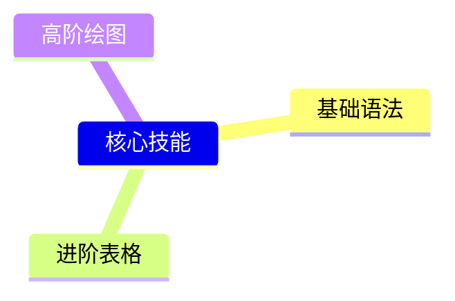

# Markdown 全栈学习指南
## 一、Markdown 核心概述
### 1.1 什么是 Markdown
Markdown 是一种**轻量级标记语言**，以纯文本为基础，用极简符号实现格式化排版，易写、易读、跨平台兼容，无需复杂代码，即可快速完成文档、笔记、博客、技术文档、README、公众号文案等内容创作。

### 1.2 核心优势
- 语法极简：学习成本低，上手即会
- 纯文本存储：所有设备、编辑器均可打开，无格式乱码
- 全平台适配：GitHub、掘金、知乎、语雀、Typora、Obsidian、博客框架均原生支持
- 双向兼容：可一键导出 HTML、PDF、Word、图片等格式
- 拓展性强：支持 HTML 内嵌、代码块、流程图、公式、思维导图等高阶功能

## 二、基础语法（必学·高频使用）
### 2.1 标题（6级层级）
使用 `#` 定义标题，数量对应层级，空格分隔内容
```markdown
# 一级标题
## 二级标题
### 三级标题
#### 四级标题
##### 五级标题
###### 六级标题
```

### 2.2 文本样式
```markdown
# 加粗
**加粗文本**
# 斜体
*斜体文本*
# 加粗+斜体
***粗斜体文本***
# 删除线
~~删除线文本~~
# 下划线
<u>下划线文本</u>
# 高亮标记
==高亮内容==
```

### 2.3 段落与换行
1. 普通段落：直接换行书写，段落之间空一行分隔
2. 强制换行：行末尾添加**两个空格**再回车
3. 分割线：三种写法等效
```markdown
---
***
___
```

### 2.4 列表
#### 无序列表
符号：`-` / `+` / `*` + 空格
```markdown
- 无序列表项1
- 无序列表项2
- 无序列表项3
```

#### 有序列表
数字 + `.` + 空格
```markdown
1. 有序列表第一项
2. 有序列表第二项
3. 有序列表第三项
```

#### 嵌套列表
下级列表缩进 2~4 个空格
```markdown
- 一级目录
  1. 二级有序子项
  2. 二级有序子项
- 一级目录
  - 二级无序子项
```

#### 任务清单
```markdown
- [x] 已完成任务
- [ ] 未完成任务
```

### 2.5 引用
单层引用：`>` + 空格
多层嵌套：叠加 `>>`
```markdown
> 一级引用文本
>> 二级嵌套引用
```

### 2.6 链接与图片
#### 超链接
```markdown
# 行内链接
[链接显示文字](https://xxx.com)
# 引用式链接（适合重复使用）
[百度][baidu]
[baidu]: https://www.baidu.com
```

#### 图片
区别：链接加感叹号 `!`，支持本地图片/网络图片
```markdown

```

### 2.7 行内代码与代码块
#### 行内代码
单反引号 `` `内容` ``，用于标记关键词、指令
```markdown
请使用 `print()` 函数输出内容
```

#### 代码块
三反引号包裹，指定语言名称实现语法高亮
\`\`\`python
print("Hello Markdown")
\`\`\`

## 三、进阶语法（文档/技术写作必备）
### 3.1 表格
原生 Markdown 标准表格，支持对齐方式：
- `:` 居左
- `:`两侧 居中
- 右侧`:` 居右
```markdown
| 名称 | 语法 | 用途 |
| :--- | :---: | ---: |
| 加粗 | **内容** | 重点强调 |
| 斜体 | *内容* | 补充标注 |
| 引用 | > 内容 | 文案引用 |
```

### 3.2 脚注
用于论文、技术文档补充注释
```markdown
正文内容[^注释1]

[^注释1]: 这里是脚注补充说明内容
```

### 3.3 锚点跳转
实现文档内部定点跳转，适用于长文档目录
```markdown
[跳转到标题一](#标题一)
```

### 3.4 内嵌 HTML
Markdown 原生不支持的样式，可直接嵌入 HTML 标签
- 文字颜色、字体、大小
- 容器布局、居中排版
- 复杂按钮、色块<br>
<span style="color:red;color: font-size:14px;">彩色文字</span>
<center>居中文本</center>

```html
<span style="color:red;color: font-size:14px;">彩色文字</span>
<center>居中文本</center>
```

## 四、高阶拓展语法（全栈强化）
### 4.1 数学公式
主流编辑器（Typora、Obsidian、掘金）支持 LaTeX 公式
1. 行内公式：`$公式$`
2. 块级公式：`$$公式$$`
```markdown
行内公式：$E=mc^2$

块级公式：
$$
\sum_{i=1}^n x_i
$$
```

### 4.2 流程图/时序图/甘特图
基于 Mermaid 语法，GitHub、语雀、VS Code 原生支持，零绘图工具

```
graph LR
A[开始] --> B[学习Markdown]
B --> C[完成创作]
```

### 4.3 思维导图
依托 Mermaid 快速生成树形思维导图

```
mindmap
  核心技能
    基础语法
    进阶表格
    高阶绘图
```

### 4.4 折叠区块
长内容收纳折叠，精简文档版面
```markdown
<details>
<summary>点击展开查看详情</summary>
隐藏的文本内容、代码、长表格
</details>
```

## 五、主流编辑器与工具推荐
### 5.1 轻量免费编辑器
1. **Typora**：所见即所得，极简UI，新手首选，支持全语法、公式、绘图
2. **VS Code**：代码编辑器，安装 Markdown All in One 插件，适合开发者
3. **Obsidian**：笔记知识库神器，双向链接+Markdown 原生适配

### 5.2 在线编辑器
- 语雀、飞书文档：在线实时协作，企业/团队文档
-  Md2html：在线格式转换、实时预览
- 掘金/CSDN 编辑器：写作自带 Markdown 渲染

### 5.3 格式转换工具
- 导出：Markdown → PDF/Word/HTML/图片
- 互转：Word/网页内容一键转为 Markdown

## 六、实用规范与最佳实践
1. **统一空格规范**：所有标记符号后加空格（#、>、-、[]()），兼容性更强
2. **层级清晰**：标题严格按层级使用，不越级，长文档搭配目录
3. **代码标准化**：代码块必须标注语言，提升阅读与高亮效果
4. **轻量化原则**：优先使用原生 Markdown，非必要不滥用 HTML
5. **资源管理**：图片统一文件夹存放，使用相对路径，避免失效

## 七、学习路线（从零到全栈）
1. **入门阶段（1天）**
掌握标题、文本样式、列表、引用、链接、基础代码块，满足日常笔记写作
2. **进阶阶段（2~3天）**
熟练表格、任务清单、脚注、锚点、HTML 内嵌，适配技术文档、博客写作
3. **高阶阶段（1周）**
学习 Mermaid 绘图、LaTeX 公式、折叠区块、拓展语法，覆盖科研、开发、复杂文档
4. **实战沉淀**
日常笔记、项目 README、个人博客、技术文章全程使用 Markdown，固化习惯

## 八、常见问题解决方案
1. 图片加载失败：优先使用相对路径/稳定图床（GitHub、阿里云图床）
2. 格式乱码：遵循标准语法，减少小众拓展语法混用
3. 跨平台样式不一致：少用自定义 HTML 样式，以原生语法为主
4. 目录自动生成：VS Code / Typora 支持一键自动生成文档目录

---
本指南覆盖**日常使用+技术写作+科研创作+开发文档**全场景，零基础可直接跟着语法示例仿写，快速实现从入门到熟练全栈使用 Markdown。