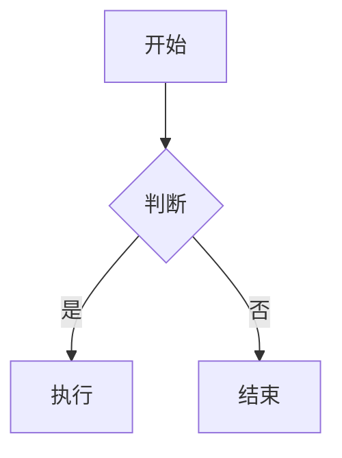
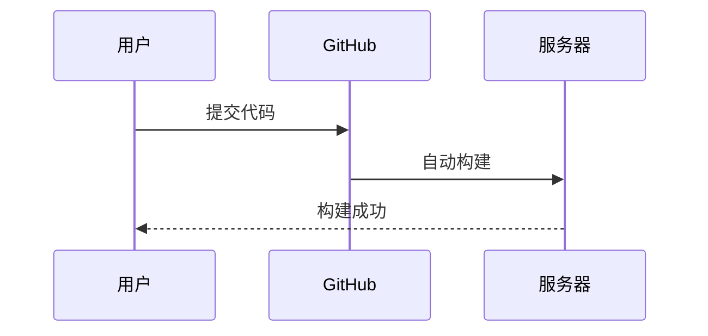

# GitHub Markdown 完全使用教程
本文**完全基于 GitHub 原生支持的 Markdown 语法**，从基础到高级，包含**完整使用方法、示例代码、渲染效果**，是 GitHub 文档、README、Issue、PR、Discussions 通用标准教程。

## 1. 基础语法
### 1.1 标题（共 6 级）
**使用方法**：使用 `#` 加空格，`#` 数量代表标题级别，1~6 级。

**示例代码**：
```markdown
# 一级标题（最大）
## 二级标题
### 三级标题
#### 四级标题
##### 五级标题
###### 六级标题（最小）
```

**渲染效果**：
# 一级标题（最大）
<div class="visual-h2">二级标题</div>
<div class="visual-h3">三级标题</div>

#### 四级标题
##### 五级标题 
###### 六级标题（最小）

---

## 2. 段落与文本格式
### 2.1 普通段落
直接书写文字，**空一行**表示分段。

**示例代码**：
```markdown
这是第一段普通文本。

这是第二段普通文本，和上一段之间空了一行。
```

**渲染效果**：
这是第一段普通文本。

这是第二段普通文本，和上一段之间空了一行。

### 2.2 粗体
**使用方法**：`**文字**` 或 `__文字__`

**示例代码**：
```markdown
这是**粗体文本**，这也是__粗体文本__。
```

**渲染效果**：
这是**粗体文本**，这也是__粗体文本__。

### 2.3 斜体
**使用方法**：`*文字*` 或 `_文字_`

**示例代码**：
```markdown
这是*斜体文本*，这也是_斜体文本_。
```

**渲染效果**：
这是*斜体文本*，这也是_斜体文本_。

### 2.4 粗斜体
**使用方法**：`***文字***` 或 `___文字___`

**示例代码**：
```markdown
这是***粗斜体文本***。
```

**渲染效果**：
这是***粗斜体文本***。

### 2.5 删除线
**使用方法**：`~~文字~~`

**示例代码**：
```markdown
这是~~删除线文本~~。
```

**渲染效果**：
这是~~删除线文本~~。

### 2.6 下划线
**使用方法**：HTML 标签 `<u>文字</u>`（GitHub 支持）

**示例代码**：
```markdown
这是<u>下划线文本</u>。
```

**渲染效果**：
这是<u>下划线文本</u>。

### 2.7 高亮文本
**使用方法**：`==文字==`（GitHub 专属）

**示例代码**：
```markdown
这是==高亮文本==。
```

**渲染效果**：
这是==高亮文本==。

### 2.8 下标
**使用方法**：`~文字~`

**示例代码**：
```markdown
H~2~O 是水，CO~2~ 是二氧化碳。
```

**渲染效果**：
H~2~O 是水，CO~2~ 是二氧化碳。

### 2.9 上标
**使用方法**：`^文字^`

**示例代码**：
```markdown
2^10^ = 1024，X^2^ + Y^2^ = Z^2^。
```

**渲染效果**：
2^10^ = 1024，X^2^ + Y^2^ = Z^2^。

---

## 3. 列表
### 3.1 无序列表
**使用方法**：`-`、`*`、`+` 加空格，支持嵌套（缩进 2/4 个空格）。

**示例代码**：
```markdown
- 列表项 1
- 列表项 2
  - 嵌套子项 1
  - 嵌套子项 2
* 另一种无序列表
+ 第三种无序列表
```

**渲染效果**：
- 列表项 1
- 列表项 2
  - 嵌套子项 1
  - 嵌套子项 2
* 另一种无序列表
+ 第三种无序列表

### 3.2 有序列表
**使用方法**：`数字.` 加空格，自动排序。

**示例代码**：
```markdown
1. 第一项
2. 第二项
3. 第三项
   1. 嵌套子项
   2. 嵌套子项
```

**渲染效果**：
1. 第一项
2. 第二项
3. 第三项
   1. 嵌套子项
   2. 嵌套子项

### 3.3 定义列表（GitHub 专属）
**使用方法**：术语 + 换行 + 缩进 `:`

**示例代码**：
```markdown
Markdown
: 轻量级标记语言

GitHub
: 全球最大的代码托管平台
```

**渲染效果**：

Markdown
: 轻量级标记语言

GitHub
: 全球最大的代码托管平台

---

## 4. 链接与图片
### 4.1 文本链接
**使用方法**：`[链接文字](链接地址 "可选标题")`

**示例代码**：
```markdown
[GitHub 官网](https://github.com "点击访问 GitHub")
```

**渲染效果**：
[GitHub 官网](https://github.com "点击访问 GitHub")

### 4.2 引用式链接（适合长文档）
**示例代码**：
```markdown
这是 [GitHub][1] 链接，这是 [百度][2] 链接。

[1]: https://github.com
[2]: https://www.baidu.com
```

**渲染效果**：
这是 [GitHub][1] 链接，这是 [百度][2] 链接。

[1]: https://github.com
[2]: https://www.baidu.com

### 4.3 自动链接
**使用方法**：直接写网址/邮箱，GitHub 自动识别。

**示例代码**：
```markdown
https://github.com
test@example.com
```

**渲染效果**：
https://github.com
test@example.com

### 4.4 图片
**使用方法**：``

**示例代码**：
```markdown

```

**渲染效果**：


### 4.5 带链接的图片
**示例代码**：
```markdown
[](https://github.com)
```

**渲染效果**：
[](https://github.com)

---

## 5. 代码块与代码高亮
### 5.1 行内代码
**使用方法**：`` `代码` ``

**示例代码**：
```markdown
执行 `npm install` 安装依赖。
```

**渲染效果**：
执行 `npm install` 安装依赖。

### 5.2 多行代码块（无高亮）
**使用方法**：三个反引号 ` ``` ` 包裹。

**示例代码**：
````markdown
```
function hello() {
  console.log("Hello GitHub");
}
```
````

**渲染效果**：
```
function hello() {
  console.log("Hello GitHub");
}
```

### 5.3 代码高亮（指定语言）
**使用方法**：``` 后加语言名称（js、python、java、bash 等）

**示例代码（JavaScript）**：
````markdown
```javascript
const name = "GitHub";
console.log(`Hello ${name}`);
```
````

**渲染效果**：
```javascript
const name = "GitHub";
console.log(`Hello ${name}`);
```

**常用语言**：`bash`、`python`、`java`、`html`、`css`、`json`、`sql`、`c++`

### 5.4 代码 diff 高亮（显示修改）
**使用方法**：`diff` 语法，`+` 新增，`-` 删除。

**示例代码**：
````markdown
```diff
- 旧代码
+ 新代码
```
````

**渲染效果**：
```diff
- 旧代码
+ 新代码
```

---

## 6. 表格
### 6.1 基础表格
**使用方法**：`| 表头 | 表头 |` + 分割行 + 内容行。

**示例代码**：
```markdown
| 姓名 | 年龄 | 职业 |
| ---- | ---- | ---- |
| 张三 | 20 | 学生 |
| 李四 | 25 | 工程师 |
```

**渲染效果**：

| 姓名 | 年龄 | 职业 |
| ---- | ---- | ---- |
| 张三 | 20 | 学生 |
| 李四 | 25 | 工程师 |

### 6.2 对齐方式
**使用方法**：
- `:---` 左对齐
- `---: ` 右对齐
- `:---:` 居中

**示例代码**：
```markdown
| 左对齐 | 居中 | 右对齐 |
| :--- | :---: | ---: |
| 文本 | 文本 | 文本 |
```

**渲染效果**：

| 左对齐 | 居中 | 右对齐 |
| :--- | :---: | ---: |
| 文本 | 文本 | 文本 |

---

## 7. 引用块
### 7.1 基础引用
**使用方法**：`>` 加空格。

**示例代码**：
```markdown
> 这是一段引用文本
```

**渲染效果**：
> 这是一段引用文本

### 7.2 多层嵌套引用
**示例代码**：
```markdown
> 第一层引用
>> 第二层引用
>>> 第三层引用
```

**渲染效果**：
> 第一层引用
>> 第二层引用
>>> 第三层引用

---

## 8. 分割线
**使用方法**：`---`、`***`、`___`（三个及以上）

**示例代码**：
```markdown
上面内容

---

下面内容
```

**渲染效果**：
上面内容

---

下面内容

---

## 9. 任务列表（GitHub 专属）
常用于 TODO 清单、项目进度。
**使用方法**：`- [ ]` 未完成，`- [x]` 已完成。

**示例代码**：
```markdown
- [x] 完成教程编写
- [ ] 发布教程
- [ ] 收集反馈
```

**渲染效果**：
- [x] 完成教程编写
- [ ] 发布教程
- [ ] 收集反馈

---

## 10. 表情符号
GitHub 支持大量 emoji 代码。
**使用方法**：`:emoji名称:`

**示例代码**：
```markdown
:smile: :star: :rocket: :bug: :white_check_mark:
```

**渲染效果**：
:smile: :star: :rocket: :bug: :white_check_mark:

常用：`:star:`⭐、`:rocket:`🚀、`:bug:`🐛、`:fire:`🔥、`:ok:`✅

---

## 11. 脚注
**使用方法**：`[^序号]` 标记，文末定义。

**示例代码**：
```markdown
这是一个带脚注的文本[^1]。

[^1]: 这是脚注的详细内容。
```

**渲染效果**：
这是一个带脚注的文本[^1]。

[^1]: 这是脚注的详细内容。

---

## 12. 警告/提示块（GitHub 专属）
官方标准提示框，比普通引用更美观。
**使用方法**：`> [!类型]` + 标题行 + 内容

支持 5 种类型：
- `[!NOTE]` 注意
- `[!TIP]` 技巧
- `[!IMPORTANT]` 重要
- `[!WARNING]` 警告
- `[!CAUTION]` 谨慎

**示例代码**：
```markdown
> [!NOTE]
> 这是一条普通提示信息。

> [!TIP]
> 这是一条实用技巧。

> [!WARNING]
> 这是一条警告信息！
```

**渲染效果**：
> [!NOTE]
> 这是一条普通提示信息。

> [!TIP]
> 这是一条实用技巧。

> [!WARNING]
> 这是一条警告信息！

---

## 13. 折叠/展开内容
适合隐藏长代码、详细说明。
**使用方法**：`<details>` + `<summary>` 标签。

**示例代码**：
```markdown
<details>
<summary>点击展开查看内容</summary>

这里是折叠的详细内容、代码、文本都可以放。

```javascript
console.log("隐藏代码");
```
</details>
```

**渲染效果**：
<details>
<summary>点击展开查看内容</summary>

这里是折叠的详细内容、代码、文本都可以放。

```javascript
console.log("隐藏代码");
```
</details>

---

## 14. 数学公式
GitHub 支持 LaTeX 数学公式。
**使用方法**：`$ 行内公式 $` 或 `$$ 块级公式 $$`

**示例代码**：
```markdown
行内公式：$E=mc^2$

块级公式：
$$
\sum_{i=1}^n i = \frac{n(n+1)}{2}
$$
```

**渲染效果**：
行内公式：$E=mc^2$

块级公式：
$$
\sum_{i=1}^n i = \frac{n(n+1)}{2}
$$

---

## 15. Mermaid 流程图（GitHub 原生支持）
**使用方法**：```mermaid 包裹流程图代码。

### 15.1 流程图
**示例代码**：
````markdown

````

**渲染效果**：


### 15.2 时序图
**示例代码**：
````markdown

````

**渲染效果**：


---

## 16. 换行与空格
### 16.1 强制换行
**方法**：行尾加 **2 个空格** 或 `<br>`。

**示例代码**：
```markdown
第一行文字  
第二行文字（上一行尾有 2 个空格）
第三行<br>第四行
```

**渲染效果**：
第一行文字  
第二行文字（上一行尾有 2 个空格）
第三行<br>第四行

### 16.2 空格
- 普通空格：直接敲空格
- 全角空格：`　`（中文排版用）

---

# 总结
这份教程覆盖了 **GitHub 100% 原生支持的 Markdown 语法**，你可以直接复制示例代码到 GitHub 的 README、Issue、PR 中使用。

核心要点：
1. 标题用 `#`，文本格式化用 `*`/`**`/`~~`
2. 代码用 `` ` `` 行内、``` 块级 + 语言高亮
3. 任务列表、提示块、Mermaid 是 GitHub 专属增强语法
4. 表格、链接、图片、折叠内容是文档必备语法